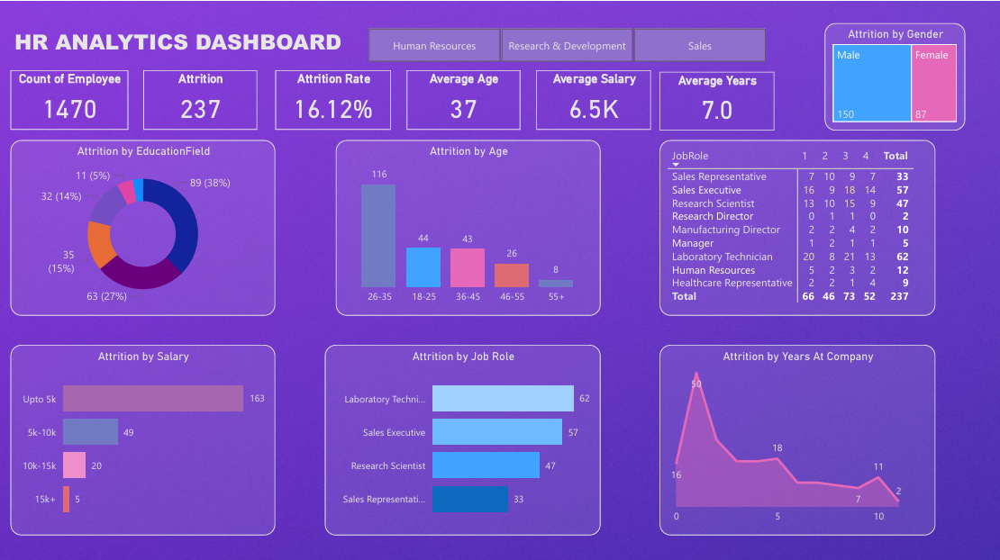

📊 HR Analytics Dashboard – Power BI
🎯 Objective

Help an organization improve employee performance and retention (reduce attrition) by creating an interactive HR Analytics Dashboard to identify attrition trends and contributing factors.

🛠 Tools Used

Power BI Desktop

Data Cleaning & Transformation: Power Query

DAX Measures for KPI calculations

📂 Dataset

Source: [Include source link or mention "Sample HR dataset" if private]

Size: 1,470 employee records

Key Features: Employee demographics, salary, job role, education, and attrition status.

📈 Key Insights

Attrition Rate: 16.12%

Highest Attrition by Age Group: 26–35 years

Top Job Roles with Attrition: Laboratory Technician, Sales Executive, Research Scientist

Salary Impact: Majority of attrition happens in employees earning up to 5k per month.

Gender Split in Attrition: 150 males vs. 87 females.

📌 Dashboard Features
## 📷 Dashboard Preview

KPIs: Total Employees, Attrition Count, Attrition Rate, Average Age, Average Salary, Average Years in Company

Visualizations:

Attrition by Age, Salary, Education Field, Gender, Job Role, Years at Company

Interactive filters for deeper analysis

Actionable Insights: Identifies vulnerable employee segments for targeted retention strategies

📷 Dashboard Preview

🚀 How to Use

Download the .pbix file from this repository.

Open with Power BI Desktop.

Explore interactive visuals and apply filters.